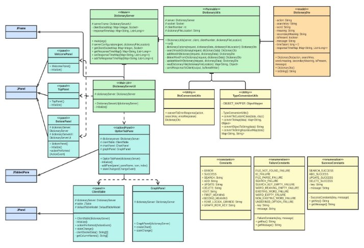
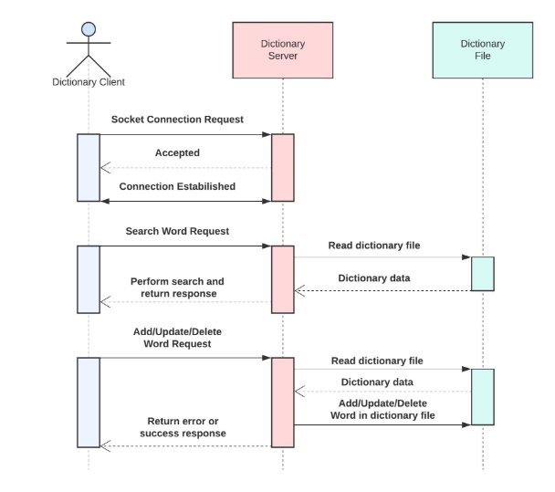
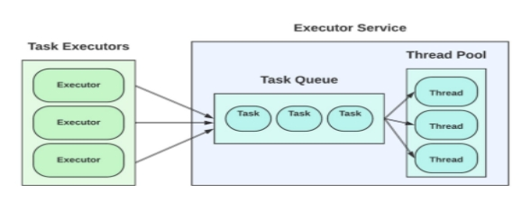
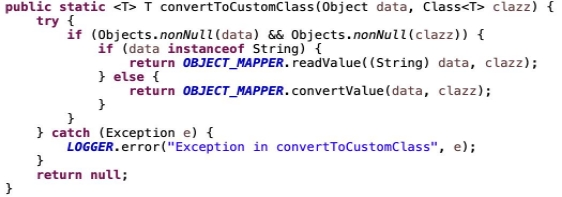
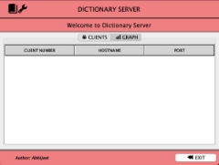

**MULTITHREADED DICTIONARY APPLICATION**

1. **Introduction**

The project implemented is related to a dictionary application with a **multi-threaded server** capable of **handling multiple clients** requesting basic dictionary operations. The application uses a **client-server** architecture with a **thread pool** worker and **user interface** for both server and client. The dictionary file uses a ***JSON* structure** for storing the words and meanings.

2. **Problem Context**

The problem statement for this application was to create a multi-threaded dictionary server that can handle multiple clients performing various operations concurrently using low-level network communication i.e sockets. The operations are - searching, adding, updating, and deleting words. All the operations once done should be visible to active as well as future clients in real-time. The user interface for the client system should be easy to understand as well as report errors that users can comprehend.

3. **Server Architecture**\
3.1. **Dictionary Server**

The server is initialized by running the ***DictionaryServer.java*** file. This is used to open a socket on the port defined by the user and wait for the client connections. The client connections are handled by a thread pool. It also keeps track of the active clients connected to the server and their respective response times for each operation.

3.2. **Dictionary Operations**

The dictionary operations are handled by the ***DictionaryUtils.java*** file which implements the *Runnable* interface. This allows each thread to execute operations on behalf of each client. The add, update and delete operations are *synchronized* methods that only allow a single thread to access the code inside these methods to maintain concurrency and consistency across clients. Multiple exception scenarios have been handled in each of the operation methods for proper error reporting.

3.3. **Dictionary Server UI**

The server user interface is initialized using the ***DictionaryServerUI.java*** file. The class itself extends a *JFrame* which makes it flexible to use and easier to code. The frame contains 3 core *JPanels* which are ***TopPanel.java***, ***WelcomePanel.java,*** and ***BottomPanel.java***. The UI also makes use of *JTabbedPane* i.e ***OptionTabPane.java*** which has 2 tabs for displaying the active client information and the second tab shows the average response time for each of the client operations. The tabs are ***ClientTable.java*** which extends *JPanel* and ***GraphPanel.java*** which generates response time graphs.

3.4. **Dictionary Server Utilities**

The server applications make use of several utility classes which have reusable code and help the main code look cleaner and more understandable for further refactoring. ***TypeConversionUtils.java*** and ***DtoConversionUtils.java*** files help convert requests and errors from the server to proper *data transfer objects* for further use. The server also makes use of frequently used constants by accessing the following files: ***Constants.java***, ***SuccessConstants.java,*** and ***FailureConstants.java***.

4. **Client Architecture**\
4.1. **Dictionary Client**

The dictionary client is initialized by running the ***DictionaryClient.java*** file. It connects to the server host address and the port defined by the user at the start of the application. Once connected to the server, it opens up an input and output stream with the server for sending requests and receiving responses. Additionally, this class processes the input provided by the user and sends the request to the server using the *handleRequestAndResponse* method. The same method also calculates the response time for each request and keeps it for further use. The client handles all types of exceptions gracefully by displaying them to the user.

4.2. **Dictionary Client UI**

The dictionary client user interface is initialized by the ***DictionaryClientUI.java*** file. The class itself extends *JFrame* for easier integration with other components. The frame contains 3 *JPanel*, which are used to display static components as well an option for exit from the client. They are ***TopPanel.java***, ***WelcomePanel.java,*** and ***BottomPanel.java***. The main component is the ***OptionTabPane.java*** which extends JTabbedPane and helps in keeping different dictionary operations in separate tabs. 4 tabs extend JPanel for handling dictionary operations. The files are ***SearchPanel.java***, ***AddPanel.java***, ***UpdatePanel.java,*** and ***DeletePanel.java***. The fifth tab uses ChartPanel to display response times for each operation in a graphical manner and logic is written in ***GraphPanel.java***. Files for each component are kept separate so that it is easier to add new components, debug issues, and refactor code in the future.

4.3. **Dictionary Client Utilities**

The client application uses utility classes for different kinds of operations such as processing the response, converting user input to request, and holding constants so that they are not duplicated everywhere. For processing the user input and converting it to relevant requests based on the action ***RequestProcessingUtils.java*** file is used. Converting the request to string format and sending it server and processing the string response to the relevant *data-transfer-object*, the ***TypeConversionUtils.java*** file is used. The ***TabPaneEnum.java*** file is used as *enumeration* for populating the dictionary client UI’s relevant fields. ***Constants.java*** file is used to hold constants that are used repeatedly in the code to reduce code duplication and keep them in a single place for further refactoring.

5. **Application Flow**

Firstly, a dictionary server application is initiated which opens up a **socket on the port**. The server keeps the socket open and **waits for client connections**. It also initiates the **dictionary server UI**. Once the dictionary server is up and running, dictionary clients are initiated. As soon as the server receives an incoming client connection request, it assigns a **thread to the particular client** for processing the client requests. The thread stays active until the client gracefully exits the application. Once the client requests a **word search**, the server reads the **dictionary file**, converts it into a **map,** and searches for the word. For other operations like **add, update and delete**, the server fetches the dictionary file again so that it gets the latest file and then **performs the relevant operations** and writes the data structure again to the file for further clients and requests to get the latest dictionary file. Once the user clicks on the exit button, the **server closes the socket** and **returns the thread** assigned to the thread pool for future clients to connect.

6. **Critical Analysis of Components**\
6.1. **TCP Connection**

The dictionary client-server architecture uses **TCP (*Transmission Control Protocol*)** for connection between the server and multiple clients. This protocol was chosen because it requires a connection to transmit data which **guarantees the delivery** of data from one connected application to other. Since each request sent by a dictionary client is important to acknowledge and respond to, guaranteed delivery is a huge advantage while using TCP. Once data is sent from one node, it also **guarantees the sequencing** of the data which cuts down on a lot of processing on both the server and the client-side. TCP also performs **extensive error checking** and **acknowledgment of data** which puts TCP over UDP in terms of reliability. Lastly, *Java* has great support for TCP and it makes it easier to code and maintain for a small-scale application like the dictionary server.

6.2. **Thread Pool Worker**

The dictionary client-server uses a **thread pool worker to assign threads** to clients that connect. Thread pool architecture was chosen for this application because if we add clients and receive a large number of requests, we may end up creating threads uncontrollably, which will ultimately lead to **depletion of resources and performance**. Thus, using this architecture helps **save resources** and keeps the server running with some **predefined limits**. It also **increases the performance** of the system scheduler that decides which thread gets access to resources next. In the application, we make use of the ***ExecutorService*** interface for creating a thread pool. To **fine-tune** the thread pool implementation we use the ***ThreadPoolExecutor***, which gives us a handle on the parameters like ***corePoolSize***, ***maximumPoolSize,*** and ***keepAliveTime***.

6.3. **Message Exchange (JSON & DTO)**

For exchanging requests and responses over the TCP network, the application makes use of **JSON (Javascript Object Notation)** format which is used for **serializing and transmitting structured data** over the network. This format of message exchange was chosen as it creates a **structured format** that is also **human-readable**. It is also easy to **read and write** this format to a java class which is known as **DTO (Data Transfer Object)**. The *JSON* string received by the client and server is **deserialized** to the ***DictonaryDto.java*** file by using the **Jackson Object Mapper**, which is a lightweight JSON library for Java.

6.4. **Dictionary File & Case Insensitivity**

For storing words and their respective meanings we use a ***JSON* file** which stores the data in a **structured manner** and makes it **easier to retrieve**. For reading the file we make use of **JSON Simple Parser** to convert the ***JSON* file to *JSON* string** and additionally use **Jackson Object Mapper** to convert the data to *Map* for **faster dictionary operations**. Since the meaning of words does not change according to the case of the words searched, we make use of **Apache’s *CaseInsenstiveMap*** which converts keys to **lower case before being added or retrieved**.

6.5. **Track Active Client & Response Times**

In addition to the problem statement, the dictionary server keeps **track of the active clients** by storing the client’s socket information in a **concurrent map**, for displaying it in the **Clients tab** of the server UI. The server also keeps **track of the response times** for each of the dictionary options for all the clients connected by using the **concurrent map**. The response times are then **averaged according to the operations** and shown in the **Graph tab** of the server UI. For creating a concurrent map we use **Java’s ConcurrentHashMap** which maintains concurrency in a multithreaded environment.

6.6. **Maven Project Management**

Both the dictionary server and client use a lot of **external JARs** for various functionalities defined above. We use **Maven** as our **project management tool** which allows a project to **centralize the dependencies** of external JARs and use them freely in our application. We also use the **Maven Shade Plugin** that helps package the application into an **executable JAR** which contains all the dependencies so that it can be executed on any machine with a *JVM*.

7. **Further Improvements**

The application has a lot of basic functionalities for dictionary operations which can be improved by **enhancing the client UI**as well as the code such as allowing **any number of meanings for a word** and **changing the structure of the dictionary JSON file**. As of now our server only detects disconnections through graceful shutdowns of the client, we can implement a **knock-knock server** that keeps checking the client connection state and work accordingly. We can also add more **debugging functionalities** on the dictionary server such as **displaying the log of requests** for each client. Additionally, a **dictionary database** can be used to store the data which provides a high level of **concurrency and stable storage**.

8. **Conclusion**

In conclusion, we created a **multi-threaded dictionary** application with a **client-server architecture** that uses a reliable **TCP connection**. It uses a **thread pool worker** for making efficient use of resources. It also **handles different kinds of errors** and reports it to the client with appropriate messages. We also use different **kinds of maps** to store relevant information and make use of **JSON** for **structured storage of data and message exchange**.

9. **References**

[1] Java Swing Tutorial, JavaTPoint, <[https://www.javatpoint.com/java-swing>](https://www.javatpoint.com/java-swing)\

[2] Intro to the Jackson ObjectMapper, Baeldung, <[https://www.baeldung.com/jackson-object-mapper-tutorial>](https://www.baeldung.com/jackson-object-mapper-tutorial)\

[3] A guide to the Java ExecutorService, Baeldung, <[https://www.baeldung.com/java-executor-service-tutorial>](https://www.baeldung.com/java-executor-service-tutorial)\
[4] Java Map with Case-Insenstive Keys, Baeldung, <[https://www.baeldung.com/java-map-with-case-insensitive-keys>](https://www.baeldung.com/java-map-with-case-insensitive-keys)\
[5] A guide to ConcurrentMap, Baeldung, <http[s://www.baeldung.com/java-concurrent-map>](https://www.baeldung.com/java-concurrent-map)\
[6] Create a fat Jar file - Maven Shade Plugin, Mykong, <[https://mkyong.com/maven/create-a-fat-jar-file-maven-shade-plugin/>](https://mkyong.com/maven/create-a-fat-jar-file-maven-shade-plugin/)\

10. **User Interface Images**

